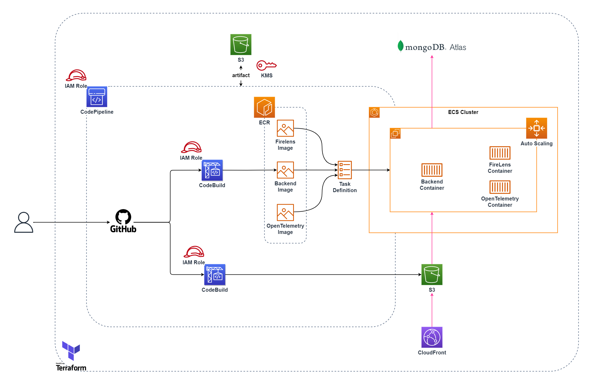

# memo-app-ecs-terraform(作成中)

※構成図は暫定です。

[istone-you/memo-app-mern-stack](https://github.com/istone-you/memo-app-mern-stack)にて作成したアプリをAWSのECSでCodePipelineを使って構築するTerraformファイルです。  
- [istone-you/memo-app-mern-stack](https://github.com/istone-you/memo-app-mern-stack)はMERN(MongoDB,Express.js,React.js,Node.js)を使用したフルスタックなアプリで、フロントエンドもバックエンドも一つのレポジトリで管理しているため、CodeBuildを二つ利用してそれぞれのECRイメージを作成します。  
- FireLensとOpenTelemetryのイメージは別途用意したものを使用して、フロントエンド、バックエンドをそれぞれ監視します。  

- MongoDBはMongoDB Atlasに構築します。
